This repository hold results for tournaments made possible by the
[Axelrod-Project](https://github.com/Axelrod-Python/Axelrod) python
library.

# Tournament result

## Standard tournament

### Ranked violin plot

The mean utility of each player.

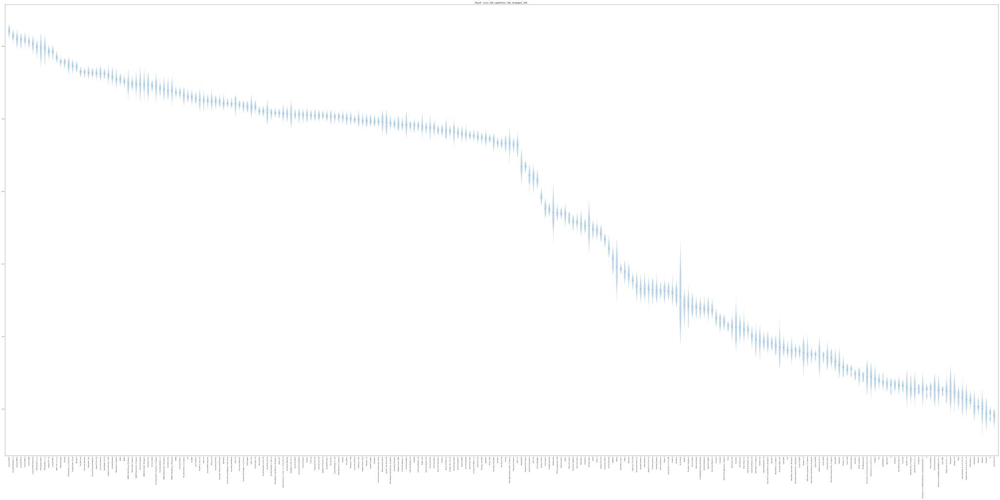

### Payoffs

The pair wise utilities of each player.

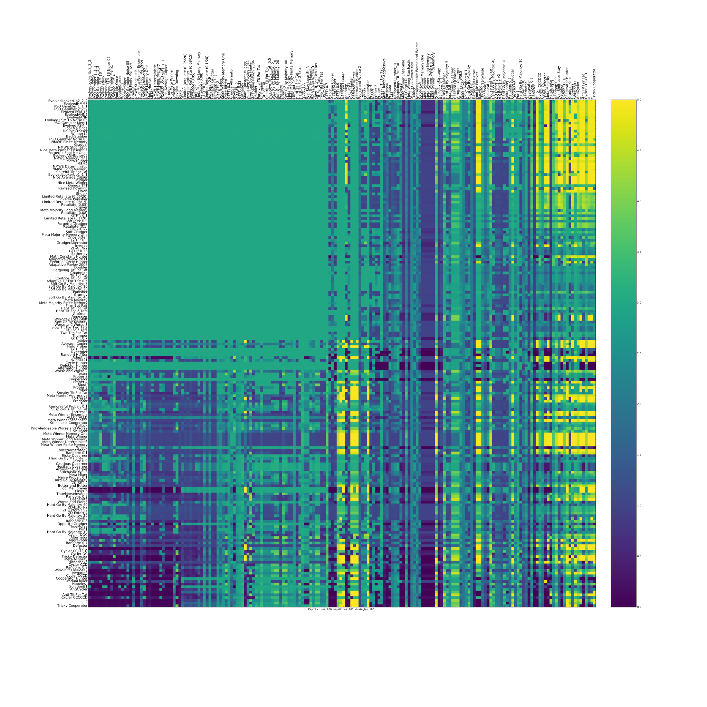

### Evolutionary dynamics

The evolutionary dynamic of the strategies (based on the utilities).

### Wins

The number of wins of each player.

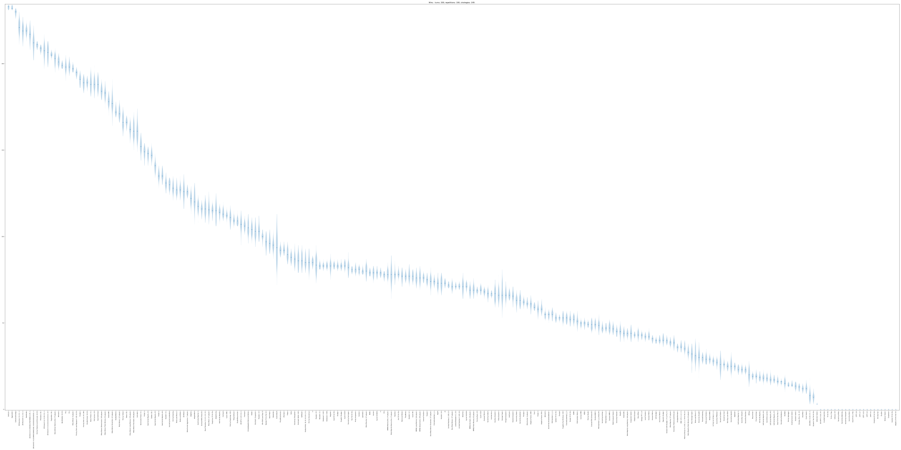

### Payoff differences

The payoff differences for each player.

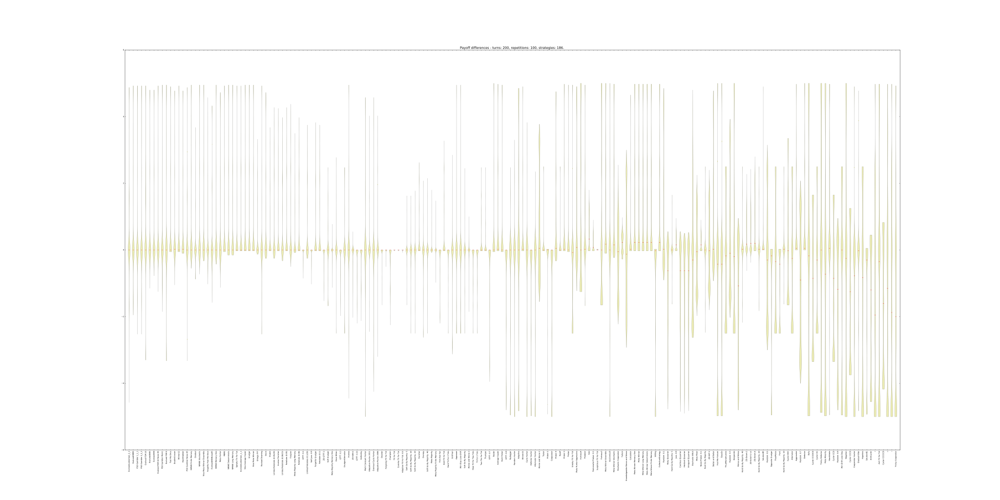

### Pairwise payoff differences

The difference of payoffs between pairs of players.

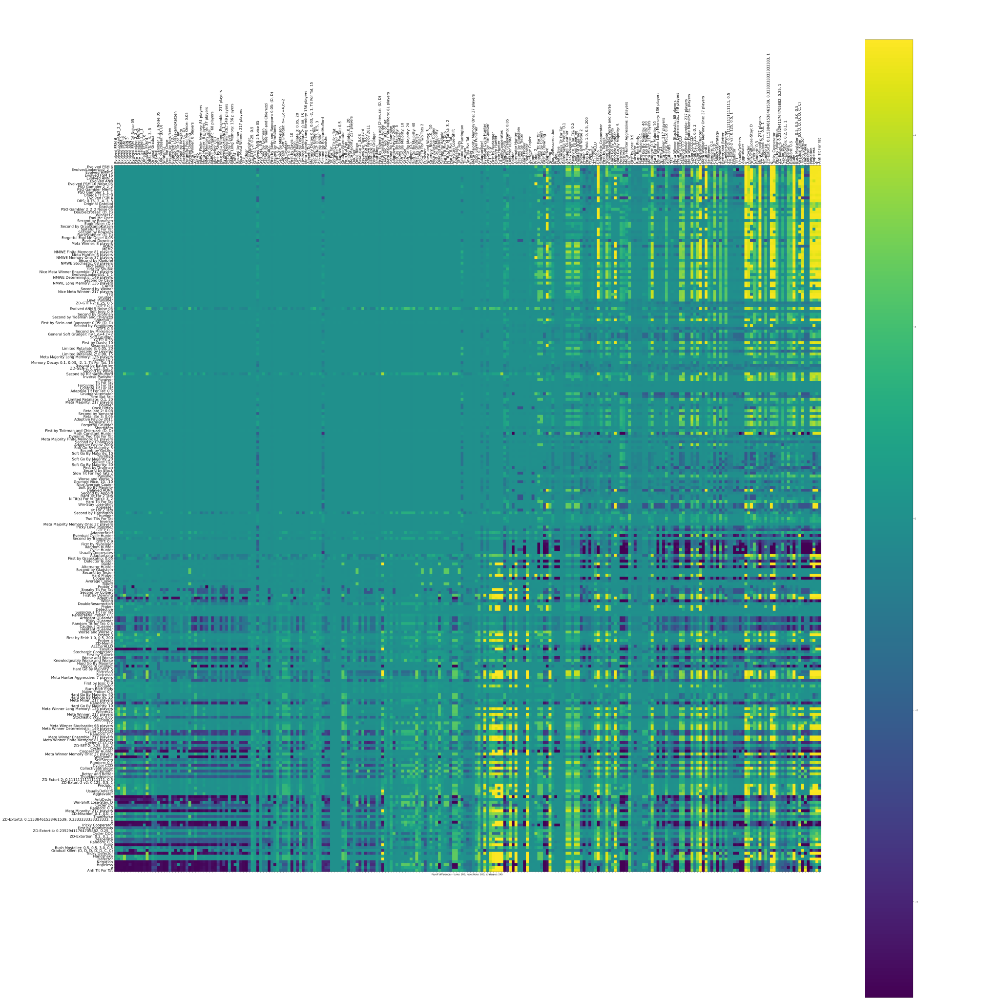

### Payoff Matrix

Here is a
[file with the payoff matrix](./assets/strategies_std_payoff_matrix.csv).

### Summary

Here is a
[file with the summary data](./assets/std_summary.csv).

## Noisy tournament

### Ranked violin plot

The mean utility of each player.

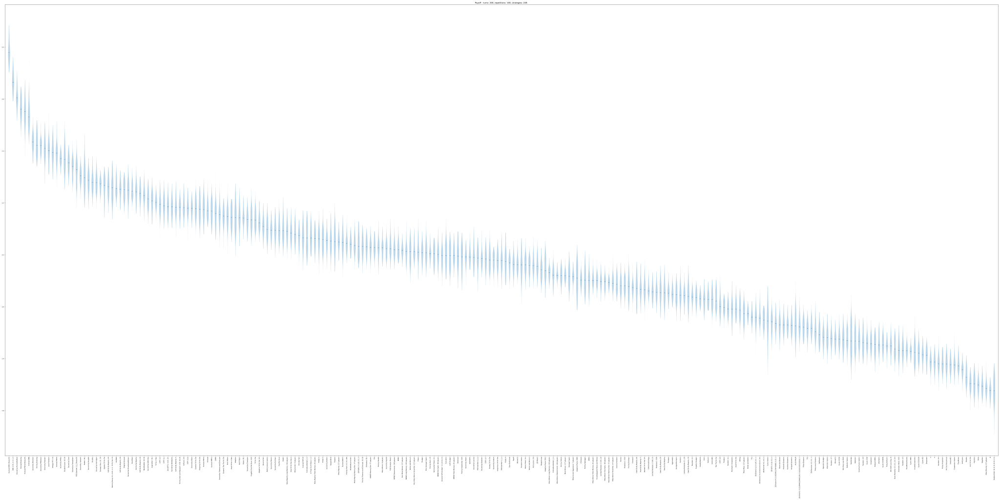

### Payoffs

The pair wise utilities of each player.

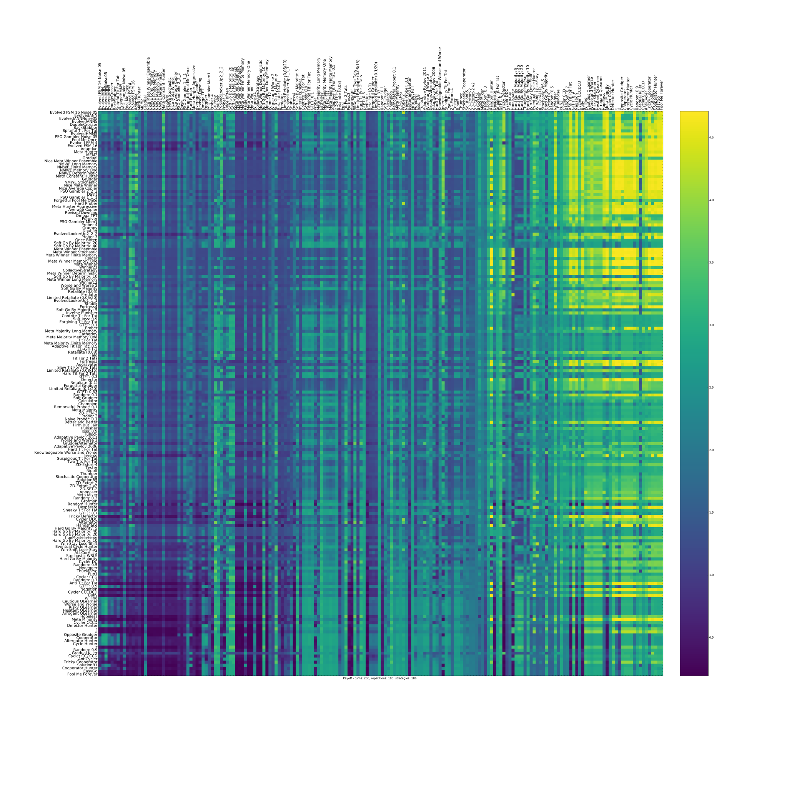

### Evolutionary dynamics

The evolutionary dynamic of the strategies (based on the utilities).

### Wins

The number of wins of each player.

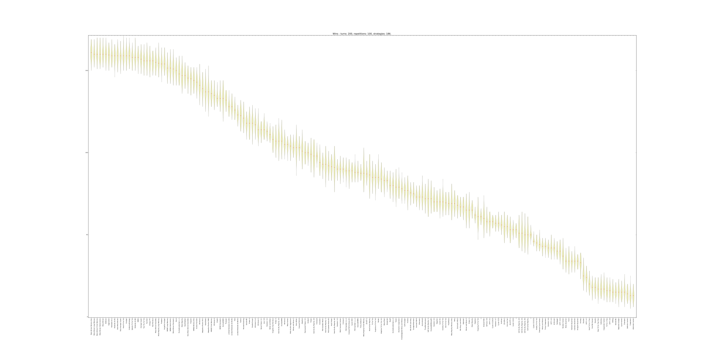

### Payoff differences

The payoff differences for each player.

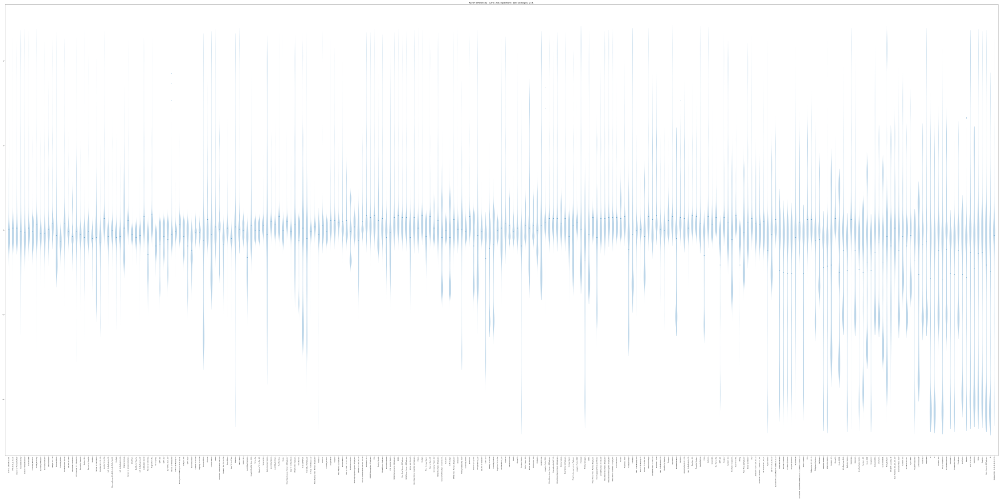

### Pairwise payoff differences

The difference of payoffs between pairs of players.

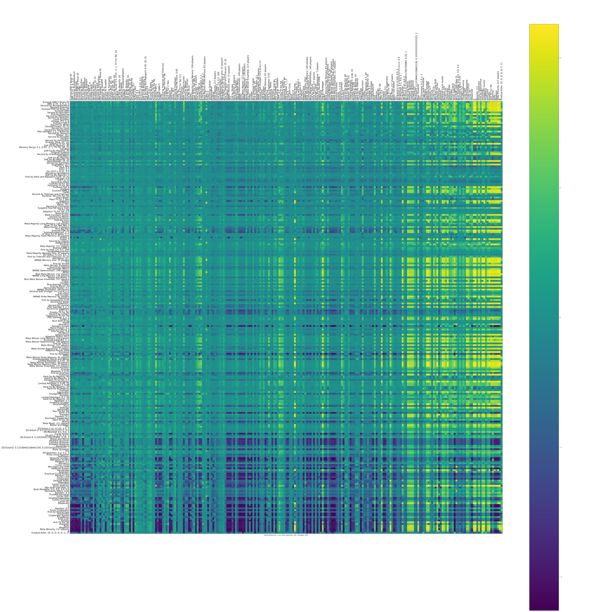

### Payoff Matrix

Here is a
[file with the payoff matrix](./assets/strategies_noisy_payoff_matrix.csv).

### Summary

Here is a
[file with the summary data](./assets/noisy_summary.csv).

## Probabilistic ending tournament

### Ranked violin plot

The mean utility of each player.

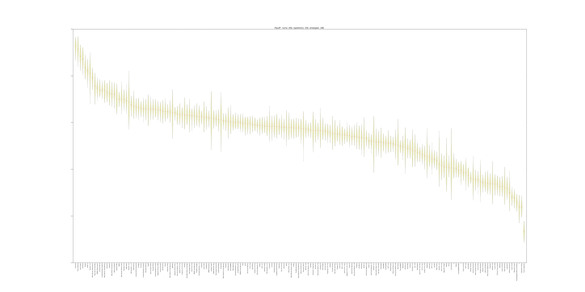

### Payoffs

The pair wise utilities of each player.

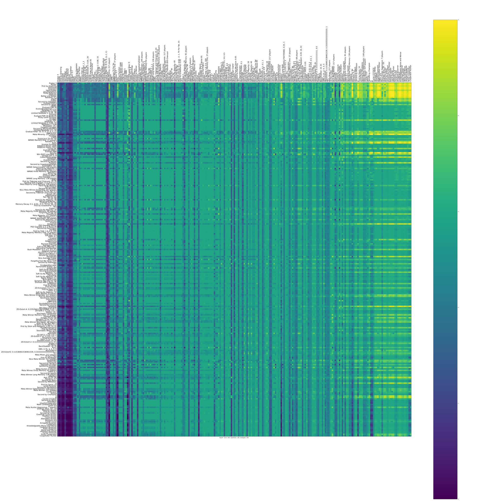

### Evolutionary dynamics

The evolutionary dynamic of the strategies (based on the utilities).

### Wins

The number of wins of each player.

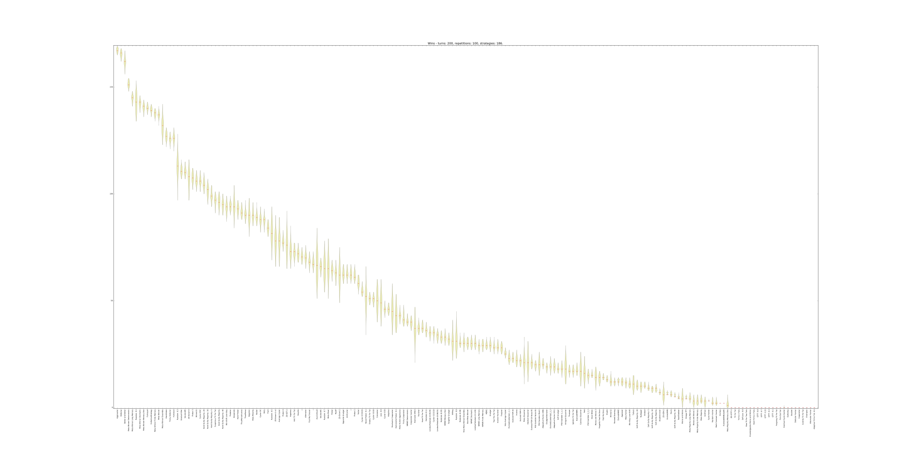

### Payoff differences

The payoff differences for each player.

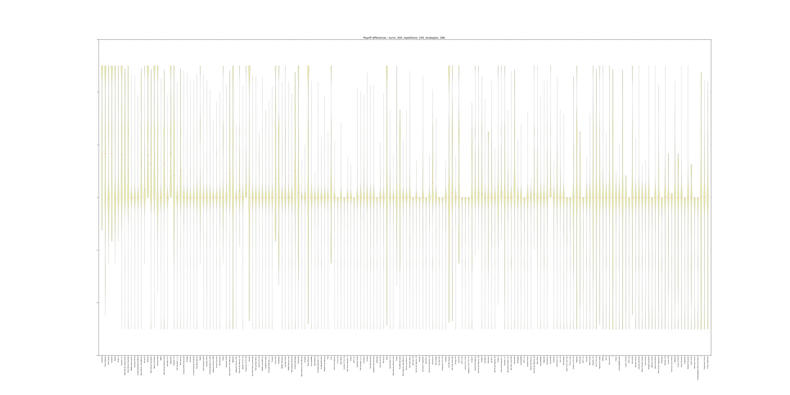

### Pairwise payoff differences

The difference of payoffs between pairs of players.

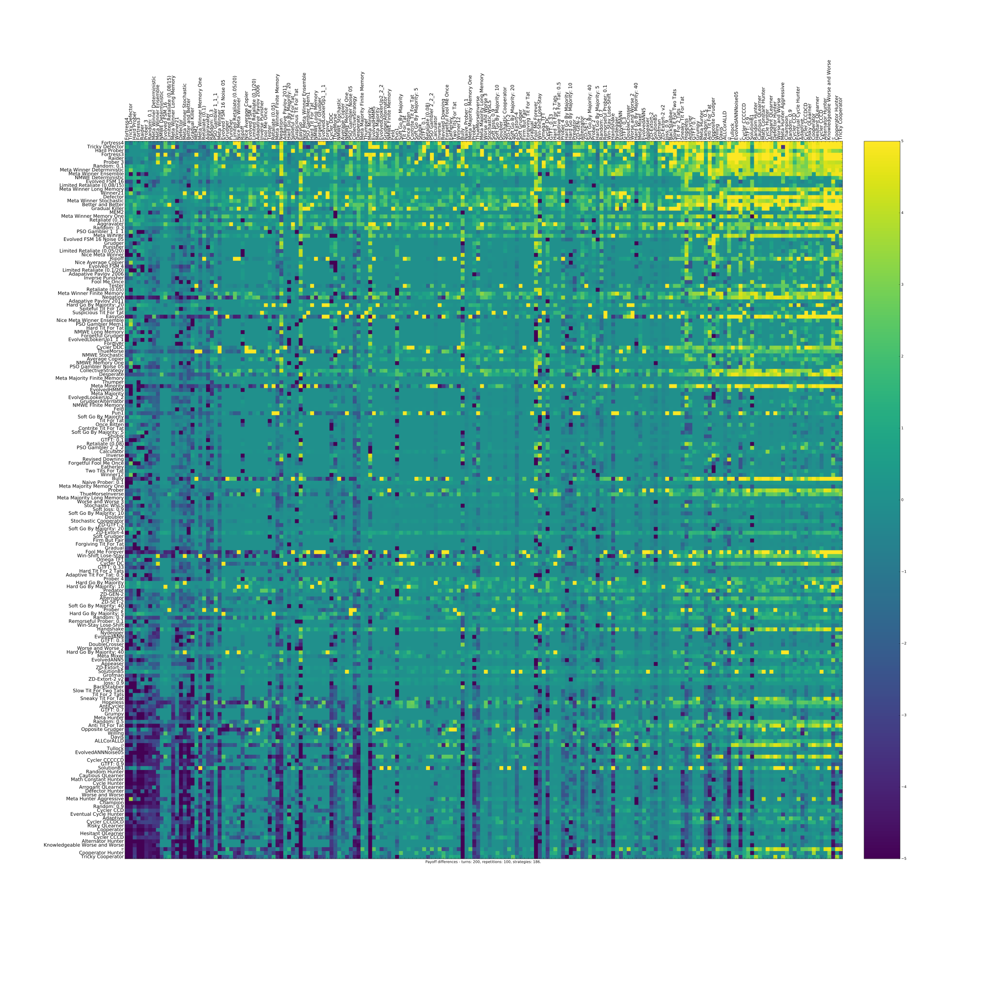

### Payoff Matrix

Here is a
[file with the payoff matrix](./assets/strategies_probend_payoff_matrix.csv).

### Summary

Here is a
[file with the summary data](./assets/probend_summary.csv).

# Reproducing these results:

To reproduce these results you will need to install the `axelrod`
library:

    $ pip install axelrod

To reproduce these results run:

    python run_noisy.py  # Run the noisy tournament
    python run_std.py  # Run the standard tournament
    python run_probend.py  # Run the probabilistic ending tournament

You can also run all three tournaments (in series):

    python run_all.py

**Note that this uses the installed version of the axelrod library.** If
you want to keep things tidy you can create a virtualenv and install the
latest version of the library like so:

    $ virtualenv env
    $ source env/bin/activate
    $ python -m pip install git+https://github.com/Axelrod-Python/Axelrod@master

If you have the Axelrod repository locally you can also run:

    $ python -m pip install path_to_axelrod

If you have already installed `axelrod` you can add the [-U]{.title-ref}
tag to update to the latest version of master:

    $ python -m pip install git+https://github.com/Axelrod-Python/Axelrod@master -U

or:

    $ python -m pip install path_to_axelrod  -U
