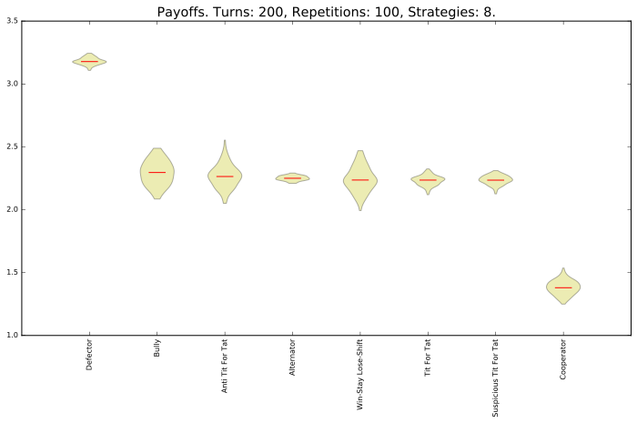
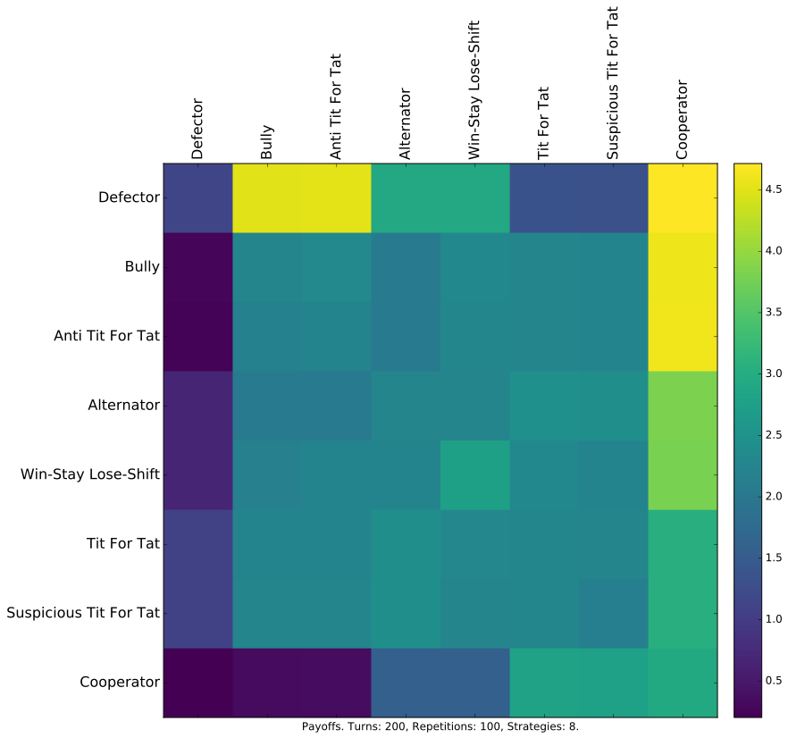
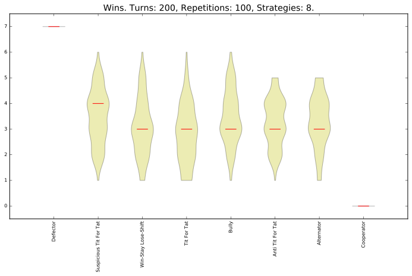
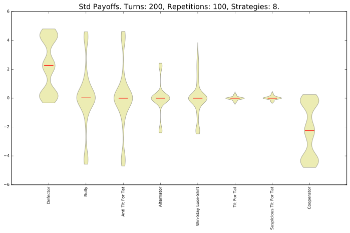
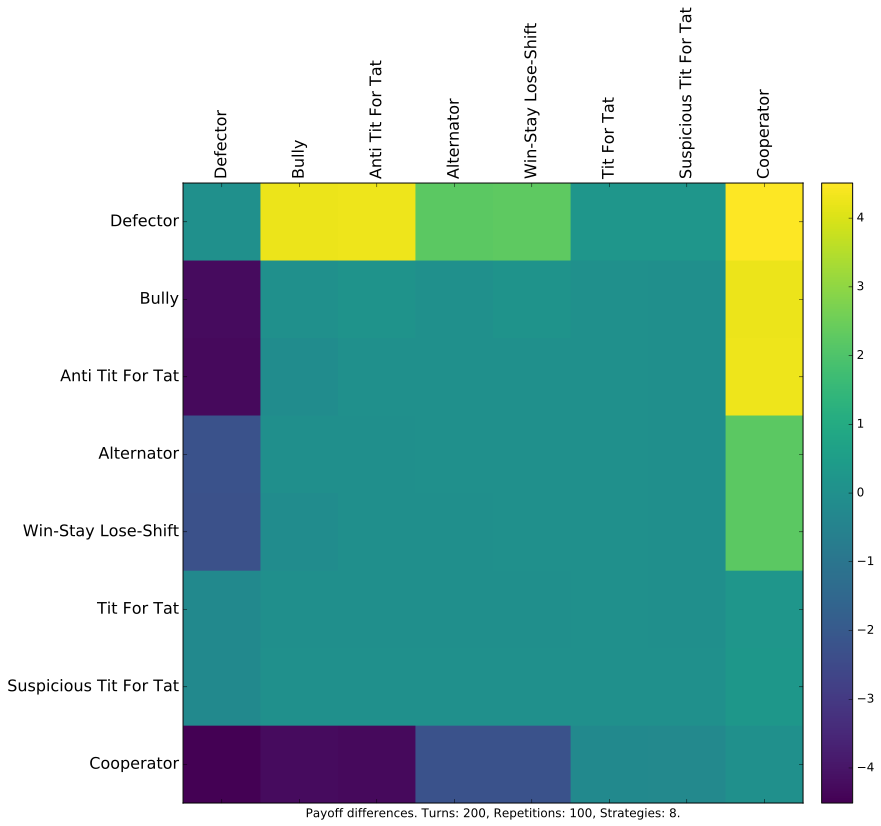

Basic Strategies and 5% noise
=============================

Ranked violin plot
------------------

The mean utility of each player.

Payoffs
-------

The pair wise utilities of each player.

Evolutionary dynamics
---------------------

The evolutionary dynamic of the strategies (based on the utilities).

.. figure:: ../../assets/basic_strategies_reproduce_noise_5.svg
   :alt: evolutionary dynamics

Wins
----

The number of wins of each player.

Payoff differences
------------------

The payoff differences for each player.

Pairwise payoff differences
---------------------------

The difference of payoffs between pairs of players.

