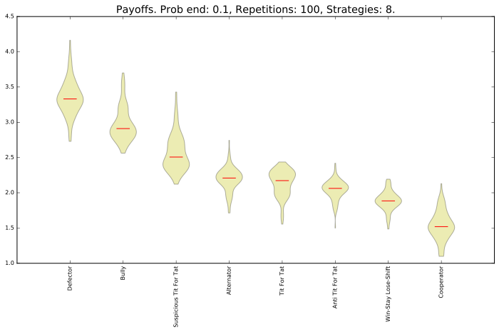
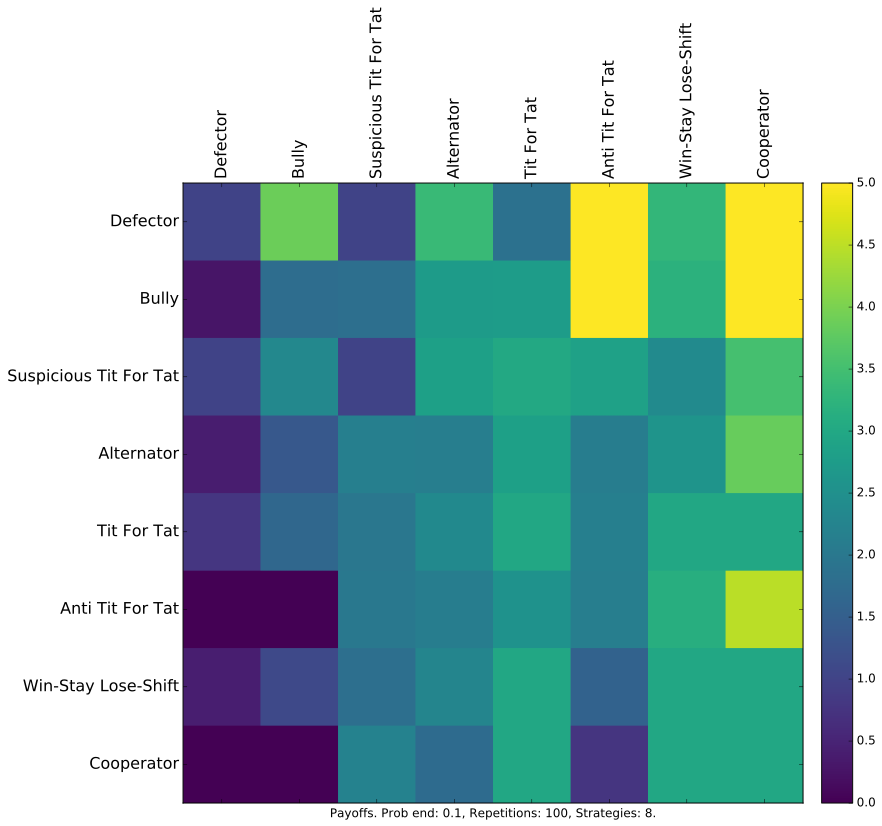
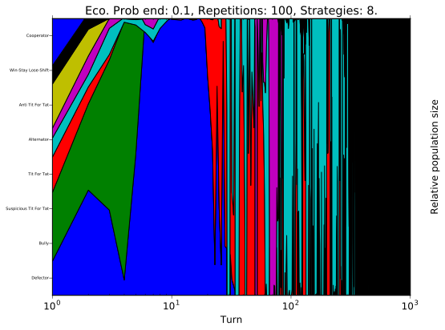
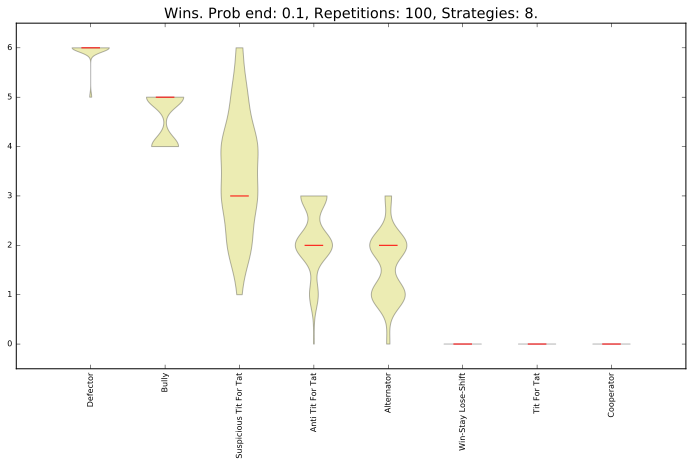
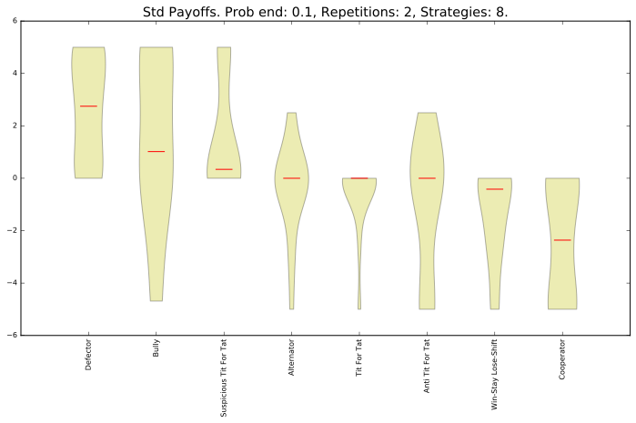
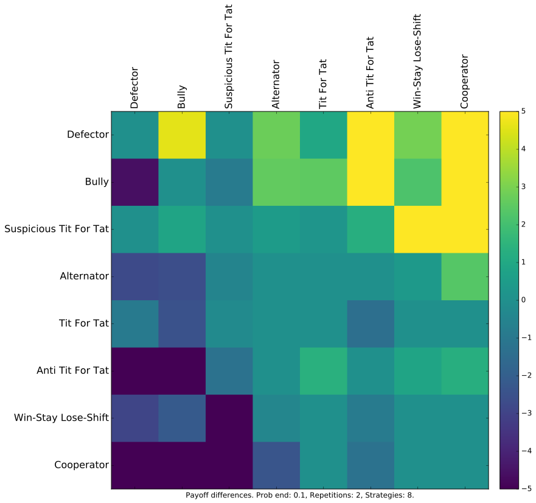
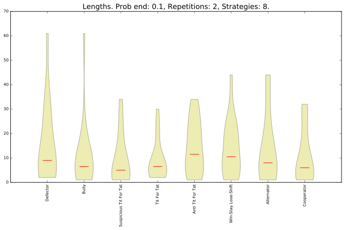

Basic strategies and 10% chance of match ending
===============================================

Ranked violin plot
------------------

The mean utility of each player.

Payoffs
-------

The pair wise utilities of each player.

Evolutionary dynamics
---------------------

The evolutionary dynamic of the strategies (based on the utilities).

Wins
----

The number of wins of each player.

Payoff differences
------------------

The payoff differences for each player.

Pairwise payoff differences
---------------------------

The difference of payoffs between pairs of players.

Match lengths
-------------

The length of the matches

