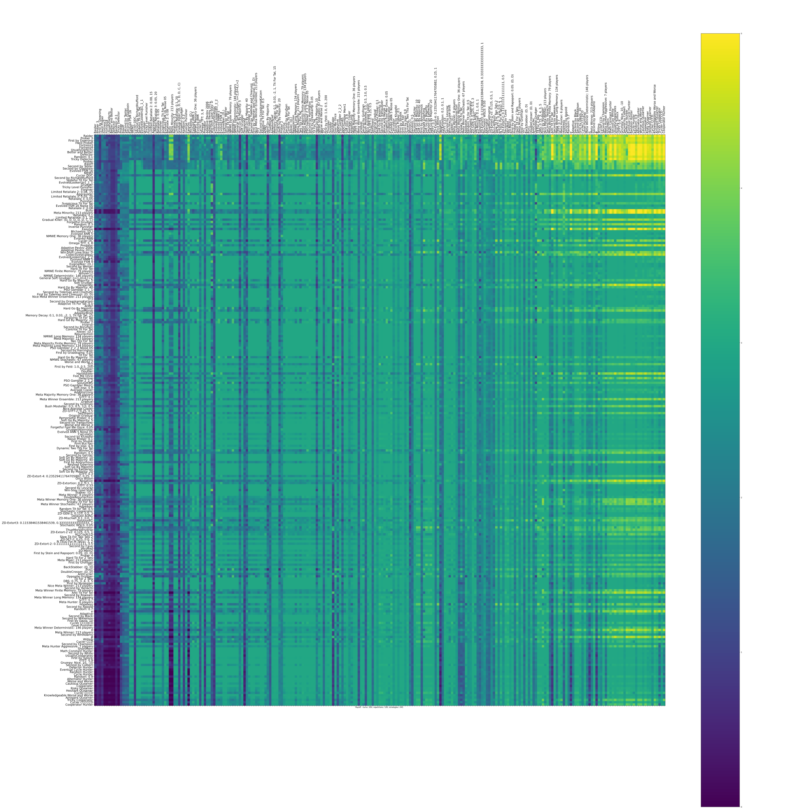
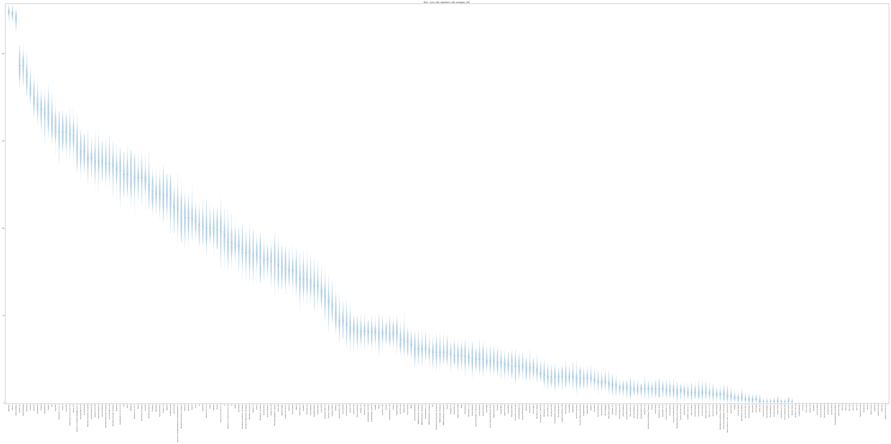
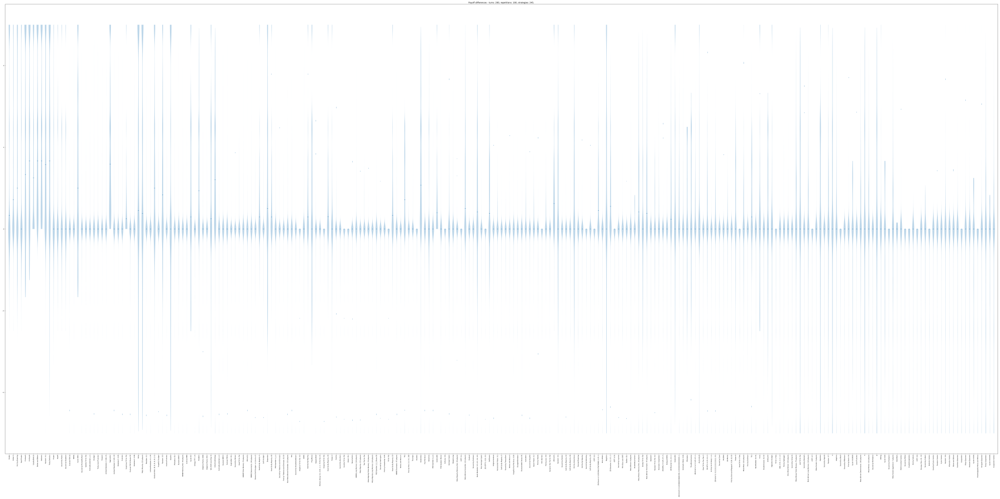
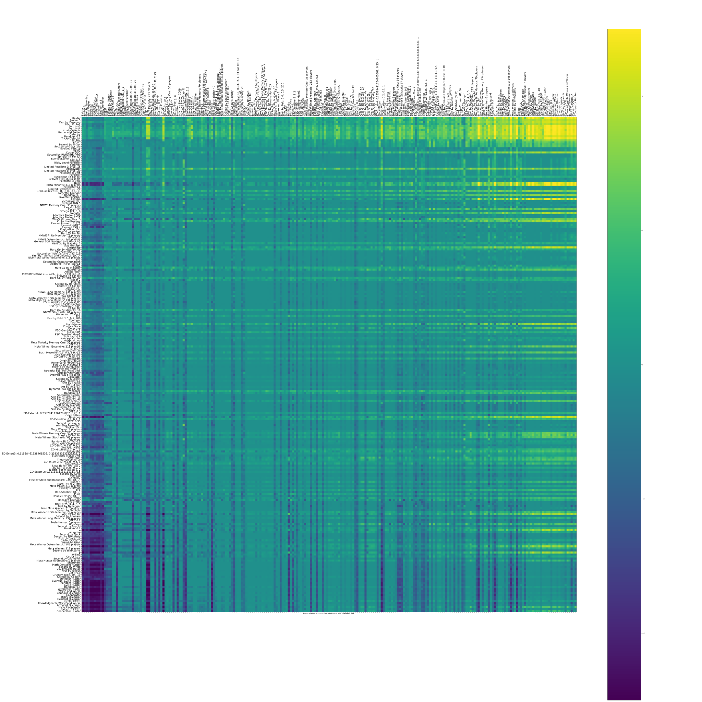
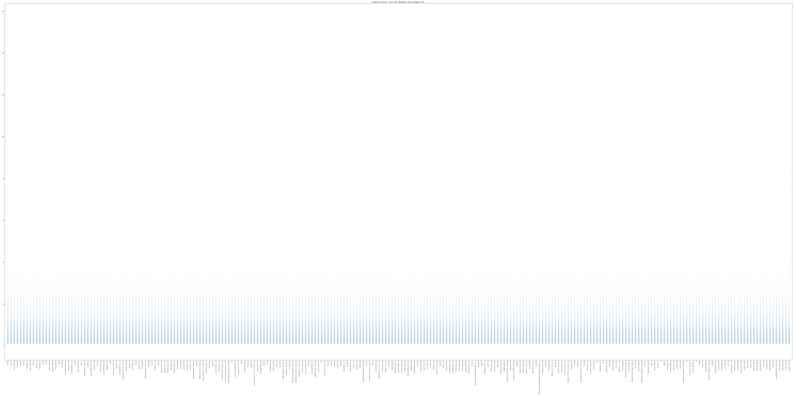

Probabilistic Ending Tournament
===============================

Ranked violin plot
------------------

The mean utility of each player.

.. figure:: ../../assets/strategies_probend_boxplot.svg

Payoffs
-------

The pair wise utilities of each player.

Evolutionary dynamics
---------------------

The evolutionary dynamic of the strategies (based on the utilities).

.. figure:: ../../assets/strategies_probend_reproduce.svg

Wins
----

The number of wins of each player.

Payoff differences
------------------

The payoff differences for each player.

Pairwise payoff differences
---------------------------

The difference of payoffs between pairs of players.

Match lengths
-------------

The length of the matches

Summary
-------

Here is a :download:`file with summary data <../../assets/probend_summary.csv>`.
